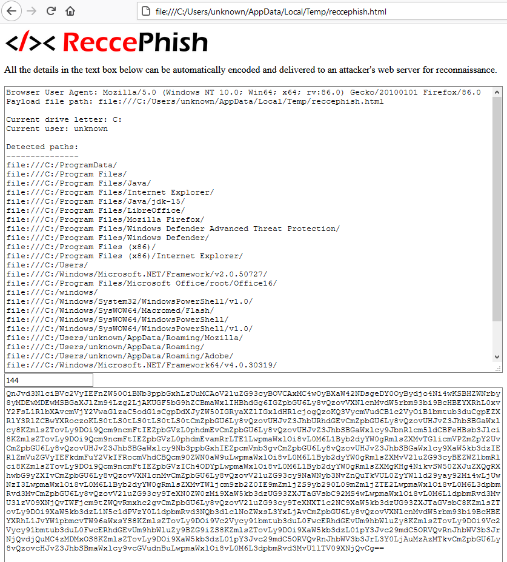

# &lt;/&gt;&lt; ReccePhish
A cross-platform phishing payload for collecting information about endpoint devices.

## How it works

ReccePhish is an HTML file that gathers each type of data listed below by leveraging default web browser functionality.

Unlike other payload files (e.g. Office Documents/macros), since HTML files can be opened and interpreted by a wide variety of desktop and mobile devices, the file is suitable for collecting information even when the operating system or device used by the recipient are unknown.

### Username collection

1. HTML files (local or remote) can read their own path from the address bar.
2. By default, most email clients save attachments in a "temp" folder somewhere in the user's home directory.
3. Since the username is disclosed in the filesystem path where the HTML attachment is opened, the username can be read by the HTML file and then delivered to the attacker.

Example: 
* The username, "JSmith", is disclosed in the path: `file:///C:/Users/JSmith/AppData/Local/Temp/attachment.htm`

### Identification of installed software packages

1. HTML files opened from the local filesystem have access to other files on the local filesystem.
2. Text/HTML files can be opened by the HTML document as CSS stylesheets.
3. Javascript can be used to determine whether a CSS stylesheet loaded successfully or not.
4. Local folders are converted to HTML directory listings by the web browser.

**Therefore:** An HTML file can determine whether a local folder exists by referencing it as an HTML stylesheet and then using Javascript to confirm whether the stylesheet was successfully load.

The attacker just needs to supply a list of filesystem paths to be tested.

### Other details that can be deduced with web requests

Using other, similar means, the same HTML file can also identify:

* The operating system and web browser used to open the file
    - Collected from the browser's User Agent string
* TCP ports allowed outbound
    - By testing the success/failure of web requests to various TCP ports (e.g. http://open.zorinaq.com:31337/)
* Whether a filtering web proxy is in use
    - By testing the success/failure of requests to widely allowed or widely disallowed web content (e.g. playboy.com)
* What type/brand of filtering web proxy is in use
    - By collecting other details about blocked content (strings, data length/type, HTTP redirects, etc.)

### More

Anything else that an email or HTML file is capable of, ReccePhish can probably do too.

* Web-bug (1x1 pixel image) type callbacks to confirm that the file was opened
* HTML smuggling additional payload files
* Delivery of targeted payloads/behavior based on endpoint detection
* ...

## Proof of concept

A basic proof of concept is included as `reccephish.html` in this repository.

### Basic, local proof-of-concept use

1. Download the `reccephish.html` file to your device - preferrably to a temporary location similar to where it would be saved by your email client.
2. Open the downloaded `reccephish.html` file in your web browser. Information collected about your computer will be shown in the text box at the top of the page.
3. The lower text box shows a Base64 encoded version of the same data. This just demonstrates how an attacker might encode the data before sending it back to their web server.

### Using ReccePhish as a phishing payload

1. Setup logging on your web server. I've included the `rp-log.php` file as a simple example of doing this with PHP. You'll need to create the file where `rp-log.php` saves its output (`rp.txt` by default) and make sure the log file is writable by the web service.
2. Next, you'll need to modify `reccephish.html` to match your phishing scenario. Some changes I recommend making to the file are:
    1. Hide all the form elements on the page. One simple method of doing this is to change the style of each form/input element to `display: none; visible: false;`.
    2. Change the form action to the proper URL on your web server where responses will be logged.
    3. Uncomment the line near the end of the file that enables automatic form submission.
    4. Replace the remaining HTML content and page title with your own HTML content.
	5. Add/remove the filepaths that ReccePhish is looking for. The default list only targets files on Windows systems.
	6. Add additional functionality. The proof-of-concept only includes username and file path enumeration. Other functionality mentioned above can be added manually.
3. You also might want to consider additional obfuscation - both of the `reccephish.html` file itself and of the data it submits to your webserver. It's really trivial for network monitoring tools to decode the Base64 data and trigger an alert on all those "C:/Windows/" strings you'll be sending back.
4. Send recon-phishing email.
5. Receive bacon.

The current list of directory paths included with ReccePhish by default checks for:

* Programs that enable payload execution:
    - Microsoft Office, web browsers, PowerShell, Python, etc.
    - .NET Framework versions
* Defensive software (EDR, antivirus, etc.)

## Additional work to be done

Some things that need to be added or researched further:

* Longer list of interesting files to collect on multiple platforms
    - Need to collect more defensive product paths
    - Need to get paths for Mac OS devices
    - Maybe mobile device paths?

## Stuff intentionally not done

I intentionally did not include any kind of obfuscation for the payload itself or the data transmitted back to the web server. That way "default" options that defenders might trigger on are kept to a minimum. HTML and Javascript are easy enough to read and modify, so this shouldn't really be much of an issue for end users.